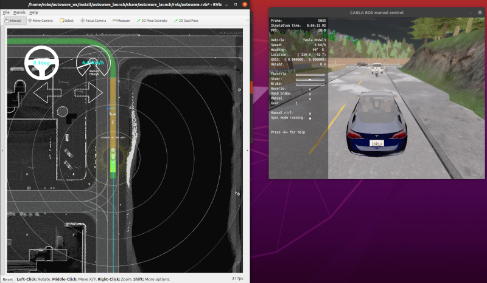

# carla_autoware_bridge
An addition package to `carla_ros_bridge` to connect CARLA simulator to Autoware Universe software.

Warning! This is **Work in Progress** repository. Reports and improvement suggestions are very welcome.

## Why carla_autoware_bridge is required?

However there is no official support of the Autoware Universe self-driving open source project from CARLA developers, there is a maintained `carla_ros_bridge`, which supports communication between CARLA simulator and ROS2 applications. This ROS2 package reuses `carla_ros_bridge` and adds missing things to support communicating with the Autoware Universe.

## Getting started tutorial

Go to [Getting started](getting-started.md) tutorial to setup and launch autoware simulation with CARLA simulator.
