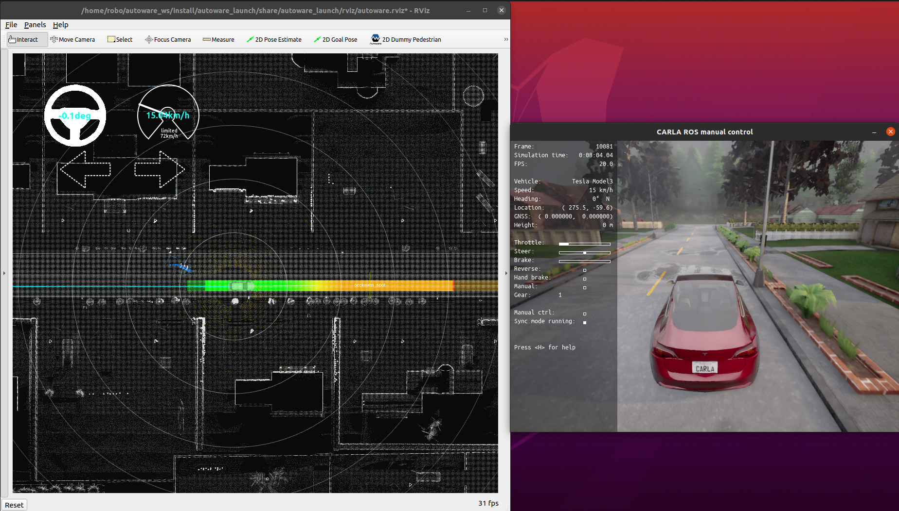

# carla_autoware_bridge
An addition package to `carla_ros_bridge` to connect CARLA simulator to Autoware Universe software.

Warning! This is still **Work in Progress** repository. Reports and improvement suggestions are very welcome.

## Why carla_autoware_bridge is required?

However there is no official support of the Autoware Universe self-driving open source project from CARLA developers, there is a maintained `carla_ros_bridge`, which supports communication between CARLA simulator and ROS2 applications. This ROS2 package reuses `carla_ros_bridge` and adds missing things to support communicating with the Autoware Universe.

## Getting started tutorial

Go to [Getting started](getting-started.md) tutorial to setup and launch autoware simulation with CARLA simulator.

## Current limitations

* only galactic support (no humble support yet)
* sensors' position/rotation and calibration were not configured properly yet

## Frequently asked questions

### Is it possible to add humble compatibility?

Currently it isn't. CARLA developers currently supports up to foxy version and it just works with galactic as well. I've asked about humble support as a part of [other discussion](https://github.com/carla-simulator/carla/discussions/6305), but I haven't got any response yet.

### Does the bridge has performance issues especially when using many lidars?

Yes, but you can take advantage of CARLA synchronous mode. By default without the `carla-autoware-bridge`, CARLA runs in asynchronous mode. The server runs the simulation as fast as possible, without waiting for the client. On synchronous mode, the server waits for a client tick, a "ready to go" message, before updating to the following simulation step. Thus a simulation together with Autoware stack can be tested even not in a performant enough machine.

### Can I use docker installation instead?

Yes, you can look at correspoding steps from [the autoware tutorials](https://autowarefoundation.github.io/autoware-documentation/galactic/installation/autoware/docker-installation/). I didn't use docker installation because of [launching rviz inside galactic docker](troubleshooting.md#launching-rviz-inside-galactic-docker) problem. It looks like humble doesn't have the same problem.

### How can I control the vehicle manually from the keyboard?

You can use manual_control_window from the CARLA ros-bridge. Just press B and then use WASD keys to control ego vehicle. Use Q key to reverse drive.

## Troubleshooting

Go to [Troubleshooting](troubleshooting.md) section in order to fix some known problems.
