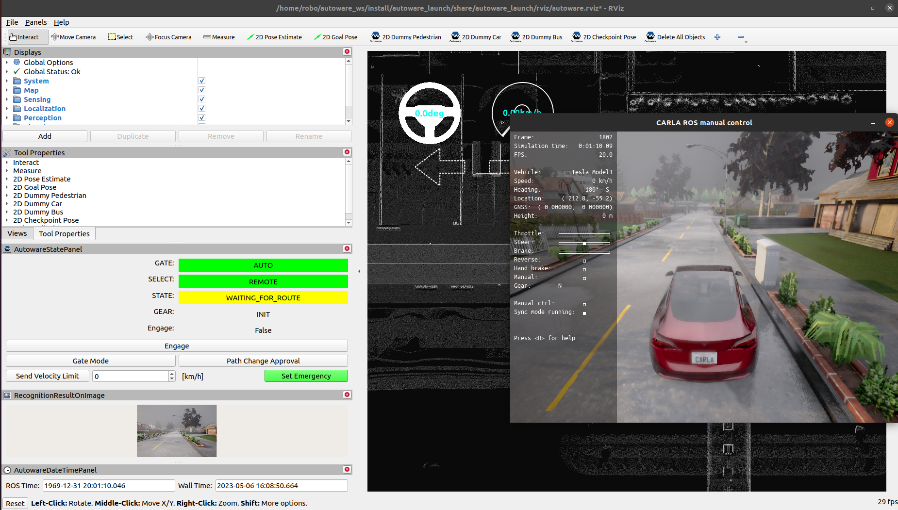
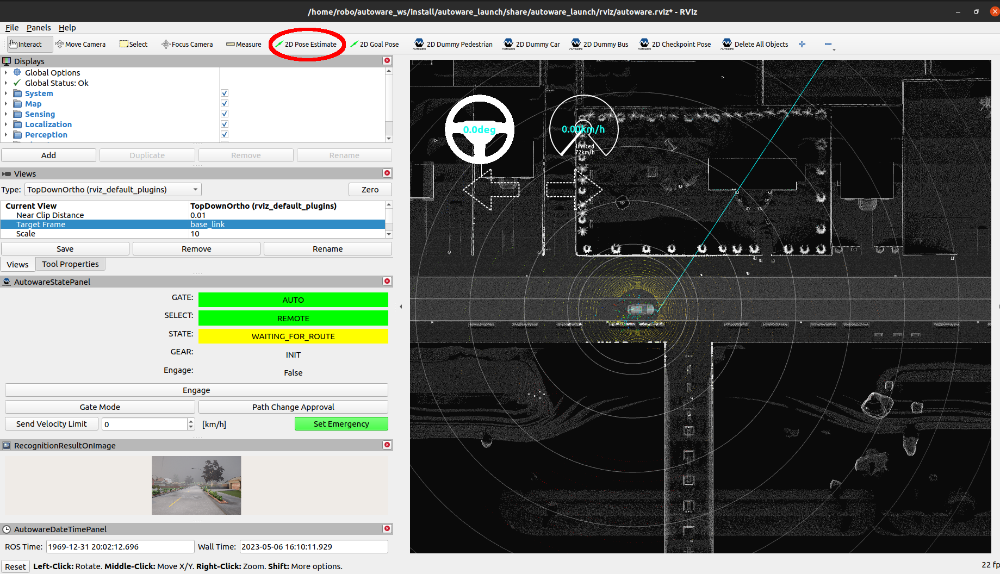
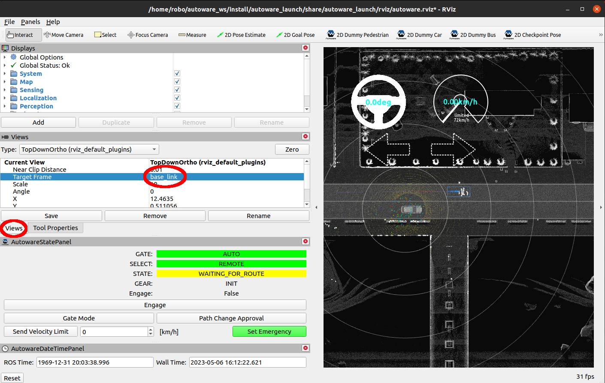
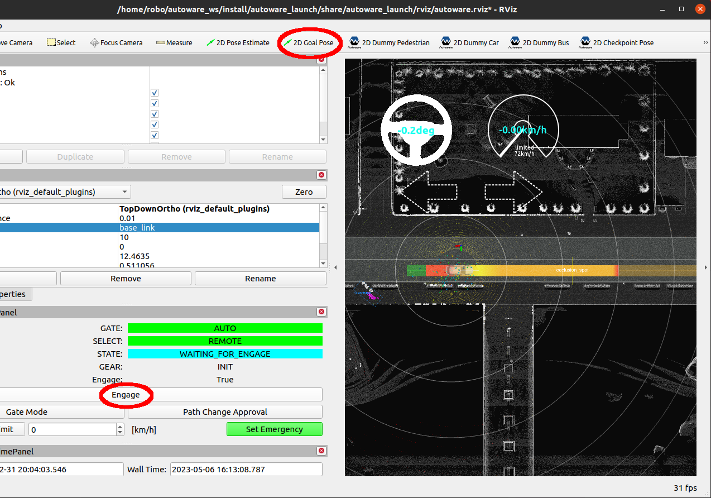

This tutorial helps with setup and launch Autoware with CARLA simulator. Reports and improvement suggestions are very welcome.

## Requirements

* Ubuntu 20.04

During the tutorial ROS 2 Galactic will be installed.

### Update and install git

Before go to the following sections update your system and install git.

```
sudo apt-get -y update
sudo apt-get -y install git
```

## Section 1 CARLA installation

### 1.1 CARLA server and client installation

Install [CARLA server 0.9.12](https://carla.readthedocs.io/en/0.9.12/start_quickstart/#carla-installation) and [carla client 0.9.12](https://carla.readthedocs.io/en/0.9.12/start_quickstart/#carla-0912).

Currently `carla-ros-bridge` has the latest `0.9.12` tag, so it is recommended to use exact the same CARLA simulator and client.

Check the CARLA with [Running CARLA steps](https://carla.readthedocs.io/en/0.9.12/start_quickstart/#running-carla) if needed.

### 1.2 Prepare map of CARLA town

Clone [autoware-contents](https://bitbucket.org/carla-simulator/autoware-contents/src/master/), copy `maps/point_cloud_maps/Town01.pcd` and `maps/vector_maps/lanelet2/Town01.osm` to `~/autoware_map/carla-town-1/` and rename to `pointcloud_map.pcd` and `lanelet2_map.osm` accordingly.

## Section 2 Autoware and carla-autoware-bridge installation

This step describes how to install [Autoware Universe](https://autowarefoundation.github.io/autoware-documentation/galactic/installation/autoware/source-installation/) from `galactic` branch via **Source Installation** and how to install [`carla-autoware-bridge`](https://github.com/Robotics010/carla_autoware_bridge) to allow Autoware-CARLA communication.

### 2.1 Set up a development environment

Clone `autowarefoundation/autoware` repo and move to the directory.

```
git clone https://github.com/autowarefoundation/autoware.git -b galactic
cd autoware
```

Install the dependencies using the provided Ansible script.

```
./setup-dev-env.sh
```

### 2.2 Add repositories required for CARLA communication

Add `ros-bridge`, `carla_autoware_bridge`, `carla_tesla_model3_description`, `carla_launch` and `carla_control_launch` repos to `autoware.repos` list.

Go to autoware/autoware.repos files and use your text editor to add the following new repositories.

```
  # carla
  carla/ros-bridge:
    type: git
    url: https://github.com/Robotics010/ros-bridge.git
    version: master
  carla/astuff_sensor_msgs:
    type: git
    url: https://github.com/astuff/astuff_sensor_msgs.git
    version: master
  carla/carla_autoware_bridge:
    type: git
    url: https://github.com/Robotics010/carla_autoware_bridge.git
    version: master
  carla/carla_tesla_model3_description:
    type: git
    url: https://github.com/Robotics010/carla_tesla_model3_description.git
    version: master
  carla/carla_launch:
    type: git
    url: https://github.com/Robotics010/carla_launch.git
    version: master
  carla/carla_control_launch:
    type: git
    url: https://github.com/Robotics010/carla_control_launch.git
    version: master
```

[`Robotics010/ros-bridge`](https://github.com/Robotics010/ros-bridge) is a fork from [`carla-simulator/ros-bridge`](https://github.com/carla-simulator/ros-bridge) and have [some changes](https://github.com/Robotics010/ros-bridge/blob/b183848fc5fa35a35a6f3381466ea245f14cfc29/CHANGELOG.md#fork-changes), that were required from Autoware.

### 2.3 Set up a workspace

Create the src directory and clone repositories into it. Autoware uses [vcstool](https://github.com/dirk-thomas/vcstool) to construct workspaces.

```
cd autoware
mkdir src
vcs import --recursive src < autoware.repos
```

Install dependent ROS packages.

```
source /opt/ros/galactic/setup.bash
rosdep install -y --from-paths src --ignore-src --rosdistro $ROS_DISTRO
```

And build the workspace.

```
colcon build --symlink-install --cmake-args -DCMAKE_BUILD_TYPE=Release
```

## Section 3 Launching ad hoc simulation

Here is a list of steps and commands to launch Autoware Universe ad hoc simulation with CARLA.

### 3.1 Launch CARLA server

```
cd to/carla/folder
./CarlaUE4.sh
```

where `to/carla/folder` is a folder path to your CARLA folder installed.

You might find these arguments useful while executing CARLA:
* `-prefernvidia` - use NVIDIA GPU for hardware acceleration
* `-carla-rpc-port=3000` - use other than 2000 default port for RPC service's port
* `-quality-level=Low` - use low quality level mode for a minimal video memory consumption

### 3.2 Launch carla_autoware_bridge

Launch `carla_autoware_bridge`, which spawns ego vehicle as well. 

```
source /opt/ros/galactic/setup.bash
source ~/autoware/install/setup.bash
ros2 launch carla_autoware_bridge carla_autoware_demo.launch.py
```

where `~/autoware` is a path to your workspace.

Here you can add the following arguments

* `port:=3000` to switch to a different CARLA port for it's RPC port
* `timeout:=10` to increase waiting time of loading a CARLA town before raising error
* `view:=true` to show third-person-view window

### 3.3 Launch Autoware Universe

And launch Autoware software stack with the following commands:

```
source /opt/ros/galactic/setup.bash
source ~/autoware/install/setup.bash
ros2 launch carla_launch e2e_simulator.launch.xml map_path:=$HOME/autoware_map/carla-town-1 vehicle_model:=carla_tesla_model3 sensor_model:=sample_sensor_kit
```

At this step your desktop should look like:



### 3.4 Set start location

Set ego vehicle start location using 2D Pose Estimate tool (highlighted by red color)



Optionally you can attach current view to the vehicle by selecting `base_link` as `Target Frame`.



### 3.5 Send route and engage

Finally send target location and allow engaging vehicle



## See also

* Go to [Troubleshooting](troubleshooting.md) section in order to fix some known problems.
